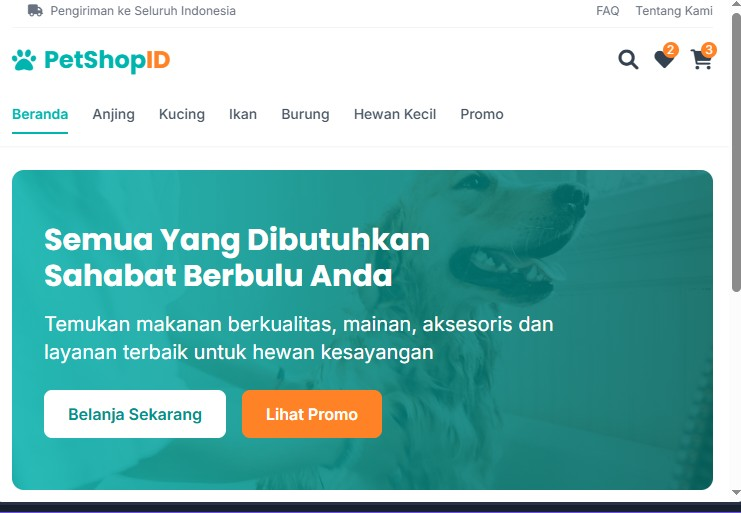

# PetShopID - E-Commerce Platform

PetShopID adalah platform e-commerce untuk kebutuhan hewan peliharaan yang ditargetkan untuk pasar Indonesia. Platform ini menyediakan berbagai produk untuk hewan peliharaan dengan pengalaman belanja online yang lengkap.



## Fitur Utama

### Untuk Pengguna
- **Katalog Produk**: Jelajahi beragam produk untuk berbagai jenis hewan peliharaan (anjing, kucing, burung, ikan, dan lainnya)
- **Pencarian & Filter**: Temukan produk dengan mudah menggunakan fungsi pencarian dan filter berdasarkan kategori, harga, dan merek
- **Keranjang Belanja**: Tambahkan produk ke keranjang dan kelola dengan mudah
- **Proses Checkout**: Proses pembayaran yang aman dan intuitif
- **Akun Pengguna**: Daftar dan kelola profil, lihat riwayat pesanan
- **Responsif**: Desain yang optimal untuk perangkat desktop dan mobile

### Untuk Admin (Coming Soon)
- **Manajemen Produk**: Tambah, edit, dan hapus produk
- **Manajemen Kategori**: Atur kategori produk
- **Manajemen Pesanan**: Lihat dan proses pesanan
- **Analitik**: Dapatkan wawasan tentang penjualan dan perilaku pengguna

## Teknologi

### Frontend
- **React**: Library JavaScript untuk membangun antarmuka pengguna
- **TypeScript**: Superset JavaScript yang menambahkan tipe statis
- **Tailwind CSS**: Framework CSS untuk desain yang cepat dan konsisten
- **shadcn/ui**: Komponen UI yang dapat digunakan kembali
- **TanStack Query**: Untuk mengelola state server dan data fetching
- **Wouter**: Untuk routing

### Backend
- **Node.js**: Runtime JavaScript untuk server
- **Express**: Framework web untuk Node.js
- **Drizzle ORM**: ORM (Object-Relational Mapping) untuk database
- **Passport.js**: Middleware otentikasi untuk Node.js

### Database
- **Memory Storage**: Penyimpanan in-memory untuk pengembangan
- **PostgreSQL**: (Planned) Database relasional untuk produksi

## Struktur Direktori

```
├── client/             # Kode frontend React
│   ├── src/
│   │   ├── components/ # Komponen UI
│   │   ├── hooks/      # Custom React hooks
│   │   ├── lib/        # Utilitas dan fungsi bantuan
│   │   ├── pages/      # Komponen halaman
│   │   └── App.tsx     # Komponen root aplikasi
│   └── index.html      # Entrypoint HTML
├── server/             # Kode backend Express
│   ├── index.ts        # Entrypoint server
│   ├── routes.ts       # Definisi rute API
│   ├── storage.ts      # Layer penyimpanan data
│   └── auth.ts         # Konfigurasi otentikasi
└── shared/             # Kode yang dibagikan antara client dan server
    └── schema.ts       # Skema model data
```

## Instalasi & Pengembangan

### Prasyarat
- Node.js 20 atau lebih baru
- npm (atau yarn/pnpm)

### Langkah-langkah Instalasi

1. Clone repositori:
   ```bash
   git clone <repository-url>
   cd petshopid
   ```

2. Install dependensi:
   ```bash
   npm install
   ```

3. Jalankan aplikasi dalam mode pengembangan:
   ```bash
   npm run dev
   ```

4. Buka browser dan akses:
   ```
   http://localhost:5000
   ```

## Deployment

PetShopID dapat di-deploy menggunakan beberapa platform:

1. **Replit**: Deploy langsung dari Replit dengan mengklik tombol deploy.
2. **Vercel/Netlify**: Deploy bagian frontend.
3. **Heroku/Railway**: Deploy bagian backend.

## Kontribusi

Kontribusi untuk meningkatkan PetShopID sangat diapresiasi. Berikut adalah langkah-langkah untuk berkontribusi:

1. Fork repositori
2. Buat branch fitur (`git checkout -b feature/amazing-feature`)
3. Commit perubahan (`git commit -m 'Add some amazing feature'`)
4. Push ke branch (`git push origin feature/amazing-feature`)
5. Buka Pull Request

## Lisensi

Distributed under the MIT License. See `LICENSE` for more information.

## Kontak

Project Link: [https://github.com/habiutomo/petshopid](https://github.com/habiutomo/petshopid)

---

jika butuh repo ini silahkan email [habizinnia@gmail.com]