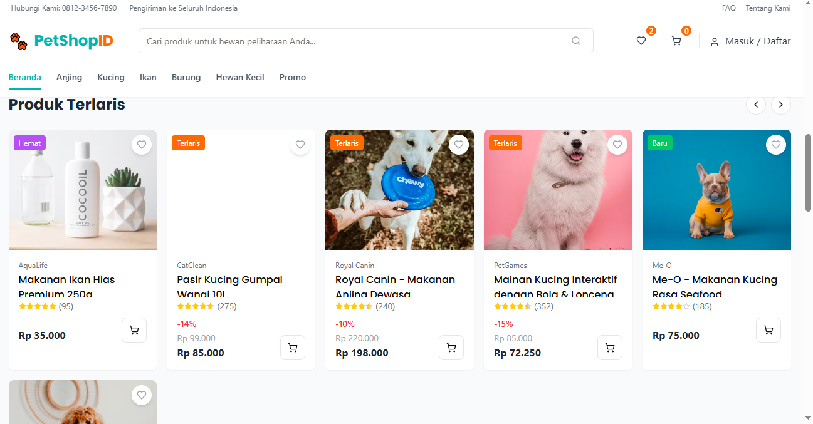

# PetShopID - E-Commerce Platform for Pet Needs

[
[
[
[
[
[

PetShopID adalah platform e-commerce lengkap untuk kebutuhan hewan peliharaan yang ditargetkan untuk pasar Indonesia. Platform ini menyediakan berbagai produk berkualitas untuk segala jenis hewan peliharaan dengan pengalaman belanja online yang mudah dan aman.

## Fitur Utama

### Untuk Pengguna
- **Katalog Produk Lengkap**: Jelajahi beragam produk untuk berbagai jenis hewan peliharaan (anjing, kucing, burung, ikan, dan lainnya)
- **Pencarian & Filter Canggih**: Temukan produk dengan mudah menggunakan fungsi pencarian dan filter berdasarkan kategori, harga, brand, dan rating
- **Keranjang Belanja**: Tambahkan produk ke keranjang dan kelola dengan mudah sebelum checkout
- **Proses Checkout yang Aman**: Nikmati proses pembayaran yang aman dengan berbagai metode pembayaran
- **Akun Pengguna**: Daftar dan kelola profil, simpan alamat pengiriman, dan lihat riwayat pesanan
- **Desain Responsif**: Pengalaman belanja yang optimal di perangkat desktop dan mobile

### Untuk Admin (Coming Soon)
- **Dashboard Admin**: Kontrol penuh atas platform dengan dashboard yang informatif
- **Manajemen Produk**: Tambah, edit, dan hapus produk dengan mudah
- **Manajemen Kategori**: Atur kategori dan subkategori produk
- **Manajemen Pesanan**: Lihat, proses, dan update status pesanan
- **Analitik**: Dapatkan wawasan mendalam tentang penjualan dan perilaku pengguna
- **Manajemen Stok**: Kelola inventaris dan stok produk

## Teknologi

### Frontend
- **React**: Library JavaScript untuk membangun antarmuka pengguna interaktif
- **TypeScript**: Superset JavaScript yang menambahkan tipe statis untuk kode lebih andal
- **Tailwind CSS**: Framework CSS utilitas-pertama untuk styling yang cepat dan konsisten
- **shadcn/ui**: Komponen UI yang dapat digunakan kembali dan mudah dikustomisasi
- **TanStack Query**: Mengelola state server dan fetching data secara efisien
- **Wouter**: Lightweight routing untuk aplikasi React

### Backend
- **Node.js**: Runtime JavaScript untuk server
- **Express**: Framework web untuk Node.js yang cepat dan minimalis
- **Drizzle ORM**: ORM (Object-Relational Mapping) modern untuk database
- **Passport.js**: Middleware otentikasi yang fleksibel untuk Node.js

### Database
- **Memory Storage**: Penyimpanan in-memory untuk pengembangan
- **PostgreSQL**: (Planned) Database relasional yang kuat untuk produksi

## Struktur Direktori

```
├── client/             # Kode frontend React
│   ├── src/
│   │   ├── components/ # Komponen UI reusable
│   │   ├── hooks/      # Custom React hooks
│   │   ├── lib/        # Utilitas dan fungsi helper
│   │   ├── pages/      # Komponen halaman
│   │   └── App.tsx     # Komponen root aplikasi
│   └── index.html      # Entrypoint HTML
├── server/             # Kode backend Express
│   ├── index.ts        # Entrypoint server
│   ├── routes.ts       # Definisi rute API
│   ├── storage.ts      # Layer penyimpanan data
│   └── auth.ts         # Konfigurasi otentikasi
└── shared/             # Kode yang dibagikan antara client dan server
    └── schema.ts       # Skema model data
```

## Instalasi & Pengembangan

### Prasyarat
- Node.js 20 atau lebih baru
- npm (atau yarn/pnpm)

### Langkah-langkah Instalasi

1. Clone repositori:
   ```bash
   git clone https://github.com/yourusername/petshopid.git
   cd petshopid
   ```

2. Install dependensi:
   ```bash
   npm install
   ```

3. Jalankan aplikasi dalam mode pengembangan:
   ```bash
   npm run dev
   ```

4. Buka browser dan akses:
   ```
   http://localhost:5000
   ```

## Deployment

PetShopID dapat di-deploy dengan mudah menggunakan Replit:

1. Fork repositori di Replit
2. Aplikasi akan otomatis dibangun dan berjalan
3. Gunakan tombol "Run" untuk memulai server
4. Untuk deployment publik, gunakan fitur "Deployment" di Replit

## Fitur yang Akan Datang

- Integrasi pembayaran dengan gateway populer di Indonesia
- Fitur wishlist untuk menyimpan produk favorit
- Sistem review dan rating produk yang lebih lengkap
- Pelacakan pesanan real-time
- PWA (Progressive Web App) untuk pengalaman mobile yang lebih baik
- Chatbot bantuan pelanggan

## Kontribusi

Kontribusi untuk meningkatkan PetShopID sangat diapresiasi. Berikut adalah langkah-langkah untuk berkontribusi:

1. Fork repositori
2. Buat branch fitur (`git checkout -b feature/amazing-feature`)
3. Commit perubahan (`git commit -m 'Add some amazing feature'`)
4. Push ke branch (`git push origin feature/amazing-feature`)
5. Buka Pull Request

## Dukungan

Jika Anda memiliki pertanyaan atau mengalami masalah, silakan buka issue di repositori GitHub.

## Lisensi

Distributed under the MIT License. See `LICENSE` for more information.

## Kontak

Project Link: [https://github.com/yourusername/petshopid](https://github.com/yourusername/petshopid)

---

Dibuat dengan ❤️ untuk komunitas pecinta hewan peliharaan Indonesia
